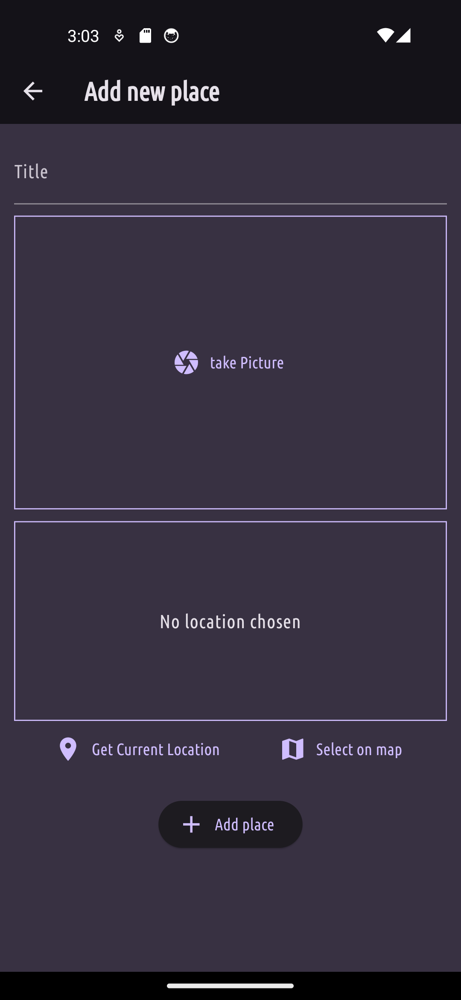
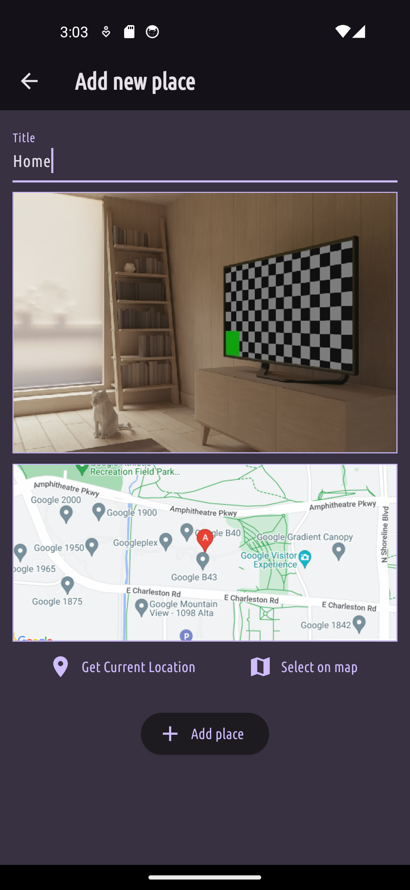

# SpotSaver

         

SpotSaver is a flutter multiplatform application used to save your favorites places. The app
gives the user the ability save locations. Each loaction item consists of:

- Title
- Image
- Location
